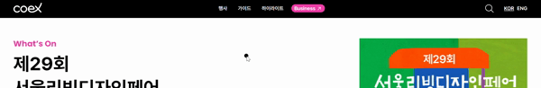
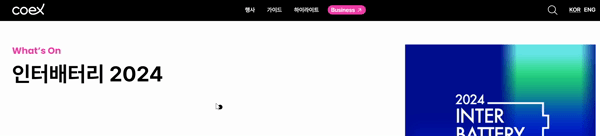
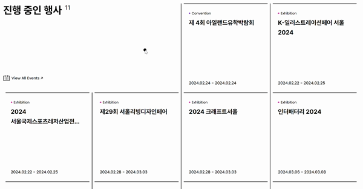

#  코엑스 홈페이지 클론 코딩

#### ✔ 코엑스 선택 이유

- 깔끔하고 세련된 디자인
- 다양한 애니메이션 효과(슬라이드, hover, 스크롤 움직임 효과 등)
- Flex or Grid를 이용한 CSS 정렬이 가능해보임

#### ✔ 사이트 주소

- [코엑스 공식 사이트](https://www.coex.co.kr/)
- [코엑스 클론코딩 사이트](https://minjoo-clonecoding-coex.netlify.app/)

#### ✔ 제작 기간

- 2024.02.20 ~ 2024.02.24

##  주요 작업 내용

### ✔ Header

#### 1. GNB 메뉴(가이드) hover시 LNB 메뉴 노출

- 전체 가로 너비 만큼의 border 적용을 위해 width를 100vw로 지정
- input의 type을 search로 지정하여 디자인 구현

#### 2. 검색창 열고 닫기

- 열기/닫기 버튼과 검색창을 Gsap을 활용하여 display 속성으로 구현

### 

#### 3. 스크롤 위로 ➡ 헤더 숨기기 / 스크롤 아래로 ➡ 헤더 보이기

- scrollTop을 이용하여 if 문으로 classList 적용

### 

### ✔ Main

#### 1. Swiper.js를 활용한 슬라이드 기능 구현

- 왼쪽 글자 영역과 오른쪽 이미지 영역(Swiper)을 따로 배치하고 나서 함께 슬라이드 되도록 구현
- Swiper에서 init, slideChangeTransitionStart를 이용하여 classList와 display의 속성 이용

### 

- swiper-button-prev과 swiper-button-next 태그로 전/후 슬라이드 이동 작업

### 

#### 2. Flex 활용한 배치 & hover 효과

- Flex로 박스 구조를 배치하고, before와 after인 가상요소로 border 처리
- filter 속성으로 hover시 블러 효과 처리

### 

- transform 속성의 scale의 변화를 주어 hover시 이미지 크기가 커지도록 구현
- 마우스커서에 원형 디자인을 픽스하고, JS에서 mousemove, mouseover, classList를 이용하여 특정 요소에 hover하면 원형 크기가 커지는 효과 적용

### 

#### 3. 스크롤 시 콘텐츠 움직임 효과

- scrollMagic 활용하여 transform 속성의 translateY 값에 따라 움직이게 함

### 

### ✔ Footer

#### 1. Flex 활용한 배치

- flex-grow와 flex-basis 속성으로 4개의 박스 모두 동일한 비율로 배치

#### 2. 패밀리사이트 열고 닫기

- classList와 toggle을 이용하여 is-open 클래스 제어

#### 3. 버튼 클릭하면 최상단으로 이동

- Gsap 활용하여 scrollTop:0일 때 opacity로 버튼 숨기기
- 스크롤 특정 값 이후에는 버튼 보이기

### 

##  아쉬운 점

- **em, rem 활용하지 못함**  
  처음 시작할 때 em, rem을 사용할까 px을 사용할까 고민하다가 계산에 익숙하지 않아서 px 단위를 사용했다. 코엑스 공식 사이트처럼 반응형에 적합한 결과물이 나오지 않아서 아쉽다.

- **중복되는 코드 사용이 잦음**  
  주로 글자 옆에 아이콘이 들어가는 디자인이 많아서, after나 before인 가상 요소를 자주 사용했다. 단순해 보이는 디자인이라고 생각했지만, 적어내는 CSS 코드의 길이는 생각보다 길었다. SCSS를 활용했으면 CSS보다 중복되는 코드의 빈도가 적지 않을까 하는 아쉬움이 든다.

- **마크업 수정 또 수정**  
  시맨틱하고 웹 접근성이 좋은 마크업을 짜기 위해 노력했지만, 이미 완성된 CSS나 JS 동작에 따라 구축 틀을 잡는 것이 생각보다 복잡하고 까다로웠다. CSS를 작업하면서 이전에 작업한 마크업을 갈아엎는 경우가 대다수였다. 마크업을 신속하고 정확하게 짜는 연습이 필요하다고 생각이 든다.

##  느낀 점

- **클래스 네이밍은 어려워**  
  강의에서 배운 BEM 방식을 도입하긴 했지만, 잘 적용한 건지 확신은 안선다.. 그래도 BEM 방식을 사용하다 보니, 어떤 부모에 어떤 자식이 있는지 직관적으로 예측 가능한 점은 아주 효율적이라고 느껴졌다.

- **예상치 못한 결과**  
  단순해보이는 hover 효과를 줄 때 원했던 결과가 나오지 않았던 경우가 종종 있었다. border의 width값을 늘리게 되면 해당 요소 위치가 살짝 변하기 때문에 outline으로 수정하게 되었다. 이처럼 간단해 보이는 작업일지라도 예상치 못한 변수가 생길 수 있기 때문에 여러가지 상황을 잘 고려해서 작업해야 겠다는 생각이 들었다.
